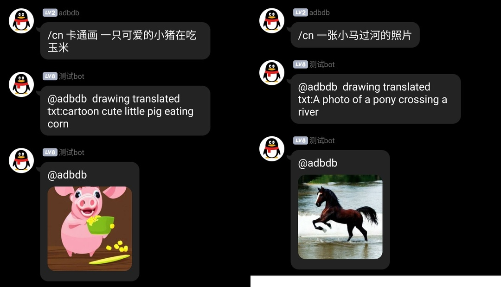

# stable-diffusion-qqbot

一个支持中文的stable-diffusion文字生成图像机器人，需要在部署docker版本的stable-diffusion时挂载模型进去

## 如何部署

1. 下载stable-diffusion的模型文件，参见 https://github.com/CompVis/stable-diffusion 选择合适的模型，如sd-v1-4.ckpt
2. 把go-cqhttp的data文件放进cqhttp文件夹，如何配置QQ号之类的请参见https://docs.go-cqhttp.org/
3. 修改docker-compose.yml，修改挂载模型位置，以及如果需要开发txt2img_serve.py可以挂载一个新的进去
4. 修改`.env`，`.env.dev`，如果修改了redis密码，还要修改`redis_conf`下的配置，如果没有使用代理服务器，就无法使用google翻译，但不会影响英文功能
5. `docker-compose up`

## 如何使用

目前支持2个命令，

`/draw english text to draw`

`/cn 中文走翻译然后再画`

## 额外参数

请参见 https://github.com/lxj616/stable-diffusion-docker-service 下的txt2img_serve.py，目前由于性能原因，锁定 50 steps，大概十几秒一张图片

QQ机器人中目前没有开放自定义参数功能，因为性能实在不够用

## bot测试QQ群

暗号是：老铁没毛病

免费分享不易，GPU资源有限，~~限时分享开放一阵子~~ 因为电脑还有其他学习任务，不定期开放，一般在周末白天分享，工作日随缘，睡觉时必定关机

## 安全 & 合规

stable-diffusion-docker-service内置使用了CompVis/stable-diffusion-safety-checker进行内容安全控制，请放心使用，如果出现疑似违规图片，会自动替换成rick的照片，如果看到以下这个照片，说明内容疑似违规了，误伤概率有点大，但还是严格一点儿比较放心

